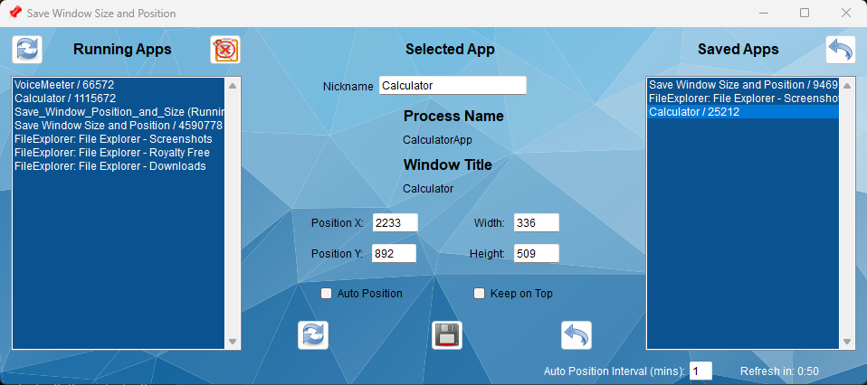

# Save_Window_Position_and_Size

# How to Use?

Move the specific app to your desired location and size then click the refresh button next to the Running Apps then find the app under the All Running Apps list and click it. 
The details will populate in the middle where you can edit and fine tune. Click the Save icon and the app will be saved. 
You can enable the Auto Position check box to check every minute by default to ensure all the saved apps are in their desired location. 
If they are not then they will be moved to their desired location and size.

# How do I update an app's location/size after changing it?

Click the app in the Saved Apps list to edit the location and size values. Click the refresh button in the middle to get the current location/size. If you move the app you will need to click the refresh button each time. 

# Save Button

The Save button saves an app, or updpates an already saved app, with its location and size along with any other available settings.

# Restore Button

The Restore button will move a saved app to its saved location and size.

# Remove a Saved App

Press the Delete Key while selecting a saved app to remove it.

# Ignore List

Add any apps that get through the filters in place that do not have any windows. Or add any windows you don't want messed with to this list by right clicking the item in the Running Apps list and clicking ignore.

# Auto Position Interval

By default this value is set to 1 minute but can be changed to any whole number. If a window's Auto Position setting is enabled, this is how long before checking to ensure the app is in its saved location. If its not then it will be moved to its saved location and size.
